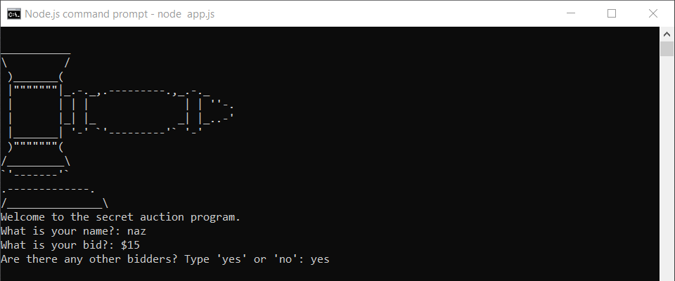
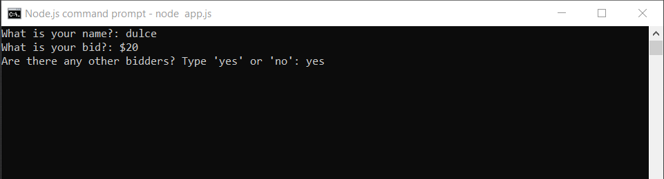
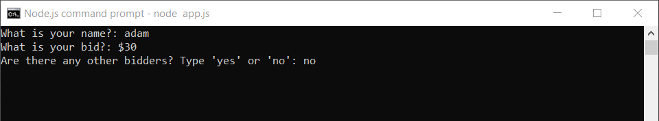
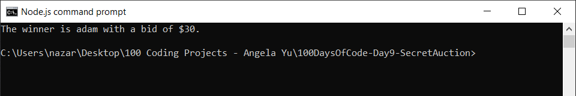

# 100 Days of Code - Day 9 - Secret Auction

# Prompt

Create a program that has the following console features:

* Display auction-related ASCII art.
* Write "Welcome to the Secret Aution Program"
* Ask the user for their name.
* Ask the user for the amount they wish to bid.
* Ask the user if there are any other bidders.
* if yes, clear the console.
* then ask the next user for their name and their bid amount.
* continue until the user says there are no other bidders
* clear the console again
* then display the name and bid of the user with the highest bid.

# Example

Welcome to the secret aution program.

What is your name?: Angela

What is your bid?: $53

Are there any other bidders? Type 'yes' or 'no'. yes

What is your name?: James

What is your bid?: $23

Are there any other bidders? Type 'yes' or 'no'. yes

What is your name?: Jenny

What is your bid?: $121

Are there any other bidders? Type 'yes' or 'no'. no

The winner is Jenny with a bid of $121.

# Screenshot of Working Solution

----------------------------------------------------------------------

----------------------------------------------------------------------

----------------------------------------------------------------------

